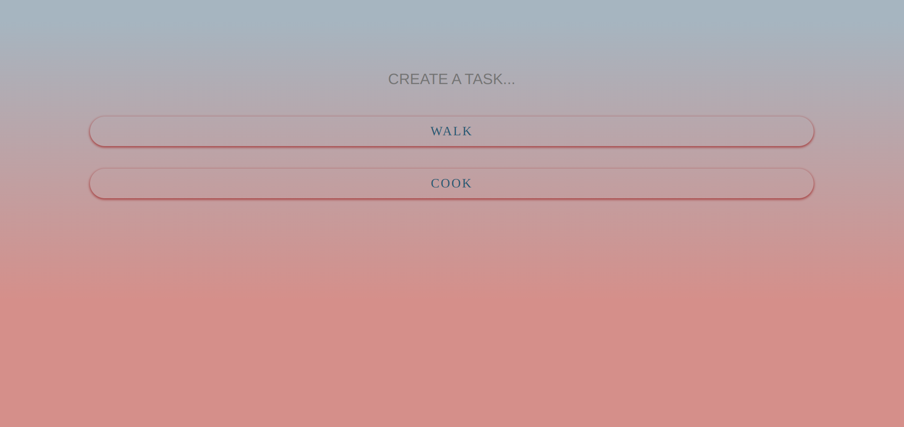
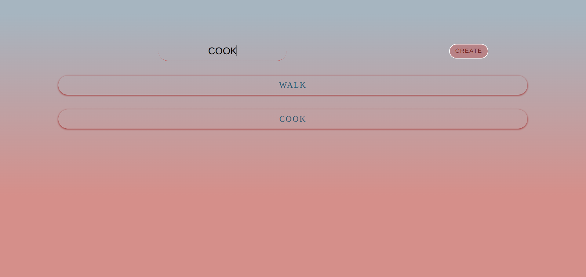
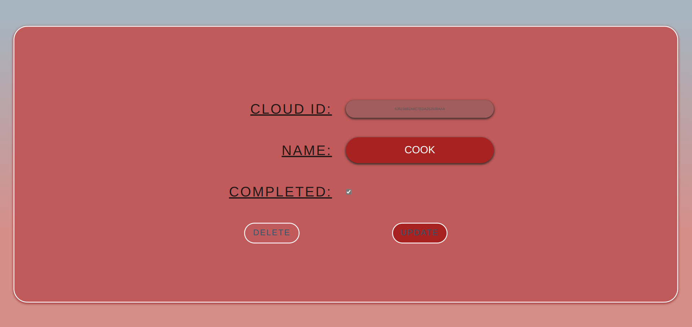

# TASK MANAGER

## DATABASE PRACTICE PROJECT NO: 1

1. A fullstack version of my previous frontend project to practice my skills using Javascript, NodeJS, ExpressJS, MongoDB, HTML, CSS.

2. Code will not work without my password to mongodb cloud which I don't upload to github.

3. In this project it brings the previous tasks which saved in cloud.

4. We can add new tasks in the app.

5. When we click on one task, it will open its page to be able to edit its name, and check or uncheck the status.

6. From this page we can also delete the task.

7. All actions will be updated in the cloud.
